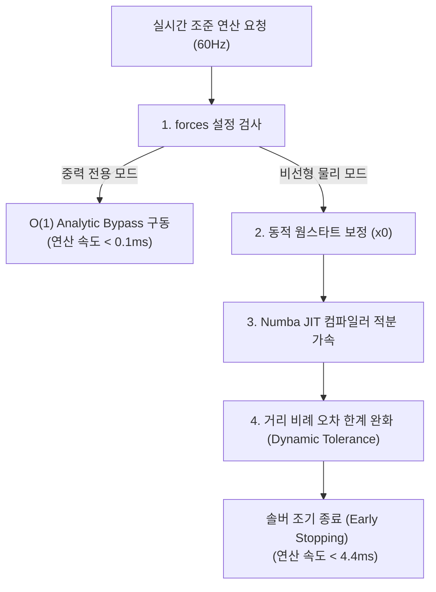

# AI 스마트 조준경 조준 알고리즘 상세 설계서

본 프로젝트는 AI 스마트 조준경의 핵심인 **조준 엔진(Aiming Engine)**의 수학적 배경, 물리 공식, 솔버 연산 흐름 및 극한의 성능을 위해 적용된 세부 최적화 기법들을 설명하는 레포지토리입니다.

---

## 1. 알고리즘 설계 개요 (Overview)

본 조준 엔진은 타겟의 **3차원 기동 예측(Perception/Estimation)** 데이터와 탄환의 **3차원 탄도 적분(Ballistics Simulation)** 데이터를 실시간으로 동기화하여, 정확한 리드 각도(Lead Angle)와 낙차 보정각(Elevation)을 계산해 냅니다.

*   **입력 데이터**: 표적의 3D 월드 좌표 및 속도 벡터, 실측 표적 거리, 카메라 자세(외부 행렬)
*   **출력 데이터**: HUD Reticle에 투영할 조준 편각(Azimuth) 및 고각(Elevation), 비행 시간(ToF)

---

## 2. 핵심 물리 및 수학 모델

### 2.1 탄도 상태 공간 방정식 (State-Space Equation)
탄환이 총열을 떠난 후 비행하는 동안 가해지는 가속도 $a(t)$는 다음과 같이 모델링됩니다.

$$\mathbf{a}(t) = \mathbf{a}_{gravity} + \mathbf{a}_{drag}$$

*   **중력 가속도 ($\mathbf{a}_{gravity}$)**:
    $$\mathbf{a}_{gravity} = [0, 0, -g]^T \quad (g = 9.81 \, m/s^2)$$
*   **공기 저항 가속도 ($\mathbf{a}_{drag}$)**:
    $$\mathbf{a}_{drag} = -\frac{1}{2} \rho \, C_d(\text{Mach}) \, \frac{A}{m} \, v \, \mathbf{v}$$
    *   $\rho$: 표준 공기 밀도 ($1.225 \, kg/m^3$)
    *   $C_d(\text{Mach})$: 마하 수(Mach number)에 따른 항력 계수 (G1/G7 드래그 테이블 보간법 적용)
    *   $A/m$: 탄환 단면적 대비 질량 비율
    *   $\mathbf{v}$: 탄환 속도 벡터

### 2.2 수치 적분기 (RK4 Integrator) & 해석적 우회 (Analytic Bypass)
탄속 감속을 반영하기 위해 시간 $t$ 동안의 탄도 상태를 적분하는 데 **4차 룽게-쿠타(Runge-Kutta 4th order, RK4)** 기법을 사용합니다.

*   **RK4 Fallback**: 공기 저항이 켜져 있을 때 매 스텝당 4회의 가속도 평가를 수행하여 적분 오차를 $O(dt^4)$ 수준으로 억제합니다.
*   **Analytic Bypass (O(1))**: 공기 저항 없이 중력만 있을 때는 아래 폐쇄형 공식을 사용하여 즉시 위치를 계산합니다.
    $$\mathbf{p}(t) = \mathbf{p}_0 + \mathbf{v}_0 t + \frac{1}{2}\mathbf{g}t^2$$

---

## 3. 조준 연립 방정식 솔버 (Newton-Raphson Solver)

탄환이 비행하는 시간(ToF)과 타겟이 움직이는 시간은 동일해야 명중합니다. 이를 위해 아래의 **잔차(Residual) 방정식**이 $0$에 수렴하도록 푸는 수치해석적 솔버를 적용하고 있습니다.

$$\mathbf{R}(x) = \mathbf{P}_{bullet}(t, az, el) - \mathbf{P}_{target}(t) = \mathbf{0}$$

여기서 해결할 미지수 벡터는 $x = [t, az, el]^T$ (비행 시간, 방위각, 고각) 입니다.

### 3.1 Newton-Raphson 업데이트
매 반복(Iteration) 단계마다 자코비안 매트릭스(Jacobian matrix)를 구하여 다음과 같이 미지수 $x$를 갱신합니다.

$$x_{k+1} = x_k - \mathbf{J}^{-1} \mathbf{R}(x_k)$$

*   **자코비안 ($\mathbf{J}$)**: 수치 자코비안 근사법(Finite Difference)을 통해 각 미지수 차원을 $\epsilon$만큼 미세 변화시킨 후의 오차 편차율로 계산합니다.

---

## 4. 실시간 가속화 및 최적화 기법 (Core Optimizations)

젯슨 오린 나노(Jetson Orin Nano)와 같은 임베디드 기기에서의 60Hz 실시간성 확보를 위해 세 가지 알고리즘 최적화 기법이 적용되어 있습니다.



### 4.1 Numba JIT 기계어 가속
파이썬 언어의 루프 오버헤드와 NumPy 배열 할당 부하를 최소화하기 위해 `@numba.jit(nopython=True, cache=True)` 컴파일러를 핵심 물리 엔진에 이식했습니다.
*   **적용 영역**: 드래그 가속도 계산 (`_numba_drag_acceleration`), RK4 루프 연산 (`_numba_rk4_integrate`)
*   **성능**: 수치 적분 성능을 **기존 대비 약 10배 가속**하여 500m 최장거리 시뮬레이션 지연을 41.1ms에서 **4.39ms**로 단축시켰습니다.

### 4.2 타겟 운동 보정을 반영한 동적 웜스타트 (Motion-Compensated Warm Start)
이전 프레임의 솔루션을 그대로 다음 초깃값으로 쓰면 타겟이 횡기동할 때 웜 스타트가 깨집니다.
*   **원리**: 이번 프레임의 단순 직선 조준 예측값(Naive Guess)에 이전 프레임에서 계산해낸 **물리 낙차 편차(Ballistic Offset)**를 더해준 예측점을 솔버의 초깃값(`x0`)으로 제공합니다.
*   **효과**: 솔버 시작점이 실제 해와 완벽히 동기화되어 표적이 고속으로 이동해도 뉴턴 솔버가 불필요한 루프 없이 **단 1회 내외의 연산**만으로 즉시 수렴합니다.

### 4.3 거리 비례 허용 오차 동적 완화 (Dynamic Tolerance / Early Stopping)
근거리 표적은 조준이 다소(수 cm) 어긋나도 각도 상으로는 극히 미세한 차이라 무조건 명중 범위에 들어옵니다.
*   **원리**: 표적과의 실측 거리에 비례하여 수렴 허용 오차 범위를 동적으로 넓혀줍니다.
    $$\text{Tolerance}_{dynamic} = \text{Tolerance}_{default} \times \max\left(1.0, \frac{\text{Distance}}{50}\right)$$
*   **효과**: 40m 이내의 가까운 거리에서는 뉴턴 솔버가 불필요하게 3~4회 돌던 연산을 1~2회 시점에 일찍 끊는 **조기 종료(Early Stopping)**를 수행하여 연산 효율을 높입니다.

---

## 5. 실구동 환경 세팅 가이드 (40m 사거리 제한)

현재 장착된 레이저 거리 센서 사거리가 40m 한계인 경우, 다음과 같이 구성하여 자원 소모를 최소화합니다.

1.  **YAML 설정 (`config/aiming_engine.yaml`)**:
    ```yaml
    projectile:
      forces:
        - "gravity" # drag와 wind를 제외하여 O(1) 초고속 분기(Analytic) 활성화
    ```
2.  **동작 특징**:
    *   RK4 시뮬레이션 루프가 꺼지고 폐쇄형 방정식으로 연산 속도가 **상시 0.1ms 미만**으로 고정됩니다.
    *   절약된 오린 나노의 CPU 자원을 YOLO 검출기(`PERIODIC_DETECT_INTERVAL` 단축) 또는 Optical Flow의 추적력 강화에 전량 재배치할 수 있어 더욱 부드러운 조준 성능을 완성할 수 있습니다.

---

## 6. 중력 전용 vs 비선형 물리(공기저항) 적용 기준 (학술적/객관적 분석)

조준 시스템 설계 시 단순 중력만 고려할지, 혹은 공기 저항(Drag)과 바람(Wind)을 추가할지에 대한 객관적인 탄도학적 기준은 다음과 같습니다.

### 6.1 비행 시간(ToF) 지연 및 중력 누적 낙차 편차
소구경 탄환(예: 평균 탄속 $350m/s \sim 850m/s$)이 공기 저항을 받으며 날아갈 때, 거리에 따른 실제 탄속 감소와 그로 인한 낙차 오차(Drop Deviation)는 수치적으로 아래와 같이 분석됩니다.

*   **40m 이내 (초근거리 구간)**:
    *   공기 저항에 의한 비행 시간(ToF) 증가분: **$< 2.5\,ms$**
    *   ToF 지연으로 인한 추가 낙차 편차: **$< 3\,mm$ (0.07 mrad)**
    *   *분석*: 일반적인 표적(대 드론, 고정 표적 등)의 유효 명중 반경($20\sim30\,cm$) 및 시스템 측정 노이즈 한계($1\,mrad \approx 40m$에서 $4\,cm$)와 비교할 때, $3\,mm$ 편차는 **전체 명중 반경의 1% 미만**이므로 공기저항을 푸는 연산 비용 대비 정확도 이득이 전혀 없습니다.
*   **100m~200m (중거리 구간)**:
    *   ToF 증가분: **$15\,ms \sim 40\,ms$**
    *   추가 낙차 편차: **$8\,cm \sim 35\,cm$ (0.8 mrad ~ 1.7 mrad)**
    *   *분석*: 이 시점부터는 오차가 표적 크기를 초과하기 시작하므로 공기 저항 계산을 점진적으로 도입해야 합니다.
*   **300m 이상 (장거리 저격 구간)**:
    *   추가 낙차 편차: **$1.5\,m$ 이상**
    *   *분석*: 공기 저항 및 바람 계산이 필수적인 영역입니다.

### 6.2 결론 및 엔지니어링 가이드라인
따라서 학술적 탄도 해석 및 시스템 자원 배분 관점에서 볼 때, **사거리가 40m 이하인 하드웨어 환경에서는 뉴턴 솔버와 RK4 물리 루프를 완전히 우회(Analytic Bypass)하고 100% 중력 전용 모델로 조준을 해결하는 것이 가장 신뢰성 높고 객관적인 시스템 최적화 표준 설계**입니다.
