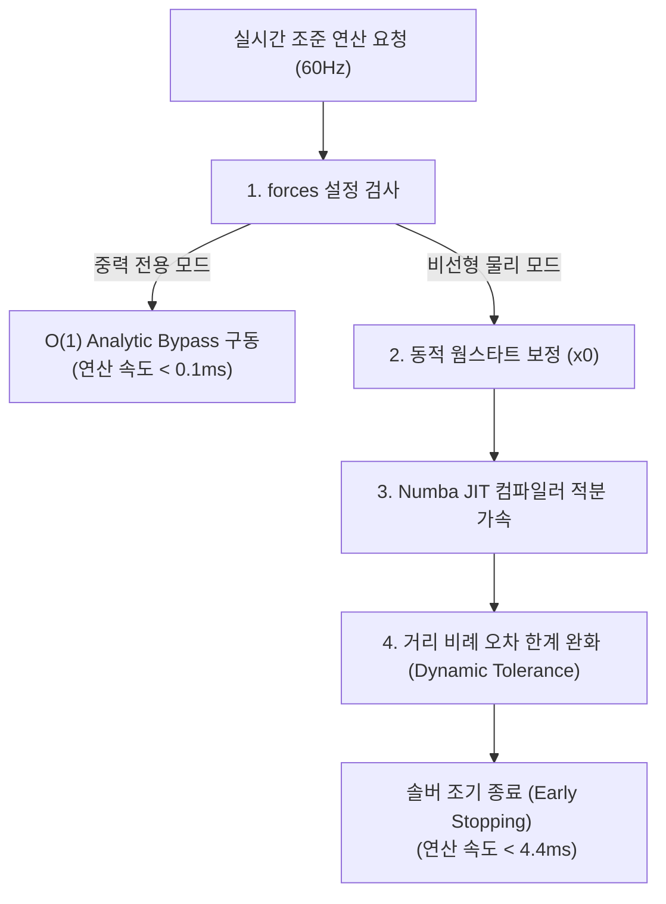

# AI 스마트 조준경 (Smart Aim-Assist Scope)

카메라 영상만으로 표적을 탐지·추적하고, 센서 데이터와 결합하여 탄도를 계산 후 HUD에 조준 보조 정보(리드각·낙차 보정각)를 띄워주는 시스템이다.

>  모든 출력값은 HUD에 표시되는 참고 정보(advisory)이며, 실제 발사 여부·시점은 항상 사람 운용자가 결정한다. 새로 추가된 신뢰도 진단 레이어(`jun_reliability`)의 STABLE/HOLD/LOST 상태 역시 조준·발사 권한이 아니라 "지금 트래킹을 얼마나 믿을 수 있는가"에 대한 진단 정보일 뿐이다. 이 원칙은 모든 모듈 docstring에 반복적으로 명시되어 있다.

---

## 1. 전체 파이프라인

```
카메라 프레임
   │
   ▼
Tracker (bridge/)               ─┐  YOLO11s-GA(GA 튜닝) + Lucas-Kanade 옵티컬플로우 하이브리드
   │  FollowerResult              │  backend: legacy(OpticalFlowTracker, .pt) | final_v20(FinalTracker, TensorRT .engine)
   ▼                             ─┘
TrackerFrameBuilder (bridge/)   ─┐  레이저거리계 + IMU 자세 융합, 시차 보정, 센서 드롭아웃 영차홀드(~100ms)
   │  TrackerFrame                │
   ▼                             ─┘
AimingManager (aiming_engine/)  ─┐  좌표변환 → 표적운동추정 → 뉴턴솔버 조준해석 → 명중확률 → 상태기계
   │  AimAssistOutput             │  (azimuth/elevation, hit_probability, aim_ready, ...)
   ▼                             ─┘
HUD → 사람 운용자 (발사 결정은 항상 사람)
```

같은 트래커 출력을 한 번만 호출해 별도로 소비하는 **진단 전용 병렬 경로**도 있다 (`jun_reliability/`, 아래 4절 참고). 아직 `AimingManager`에는 연결되어 있지 않은 독립 모듈이다.

```
Tracker.update() 결과 (한 번만 호출, fan-out)
   ├─▶ TrackerFrameBuilder → AimingManager → HUD   (기존 운용 경로)
   └─▶ jun_reliability 파이프라인 → STABLE/HOLD/LOST (진단 전용, 아직 미연결)
```

---

## 2. 디렉토리 구조

```
smash/
├── aiming_engine/        조준/탄도 계산 코어 (하드웨어 독립, 순수 수학)
├── bridge/               카메라·트래커·센서를 aiming_engine 입력으로 변환하는 접착 계층
├── jun_reliability/      트래킹 신뢰도 진단 레이어 (STABLE/HOLD/LOST, 발사 권한 아님)
├── detector+tracker/     YOLO 학습(GA 튜닝) + 검증된 최종 추적 알고리즘의 원본(reference) 소스
├── simulation/           Gazebo Harmonic + ROS 2 Jazzy 3D 포탑 시뮬레이터 (SMASH FCS)
├── gazebo/               Gazebo 시뮬레이션 기반 Level-2 통합 테스트
├── config/               YAML 설정 (aiming_engine.yaml, bridge*.yaml)
├── examples/             end-to-end 데모 스크립트
├── scripts/              시뮬레이터·검증·패키징 스크립트 (04/06 시뮬레이터, 07/08 검증, wsl_setup)
├── tests/                pytest 단위 테스트 (모듈별 1:1 대응)
├── test/                 검증용 정답 데이터 (visible.json 등) — tests/ 와 다른 폴더
├── docs/
│   ├── reports/          단계별 검증 보고서 (stage1/stage2, level1_level2, aim_oracle)
│   ├── analysis/         분석 문서 (known_issues, sensor_integration_gap_analysis, ...)
│   ├── sessions/         작업 세션 기록
│   ├── interim_reports/  중간 보고서
│   └── pdfs/             참고 논문 텍스트
├── results/              실행 산출물 (stage2_lead_accuracy_results.json, intermediate_results/)
├── run_smash_fcs.bat     Gazebo/ROS 2 시뮬레이터 런처 (WSL2)
├── run_pipeline.bat/.py  Windows 네이티브 파이프라인 런처
├── requirements.txt / requirements-bridge-hardware.txt
└── pytest.ini
```

---

## 3. `bridge/` — 하드웨어·트래커 접착 계층

`detector+tracker/final/`에서 검증된 YOLO + Lucas-Kanade 옵티컬플로우 하이브리드 추적기를 실시간 `update(frame) -> FollowerResult` 형태로 이식한 계층이다. **과거의 칼만필터 기반 `SmartTracker`(`bridge/smart_tracking/`)는 제거되었고**, 지금은 이 방식이 유일한 추적기다.

### 3.1 트래커 백엔드 두 가지

| 항목 | `legacy` (`OpticalFlowTracker`) | `final_v20` (`FinalTracker`) |
|---|---|---|
| 용도 | 데스크톱 개발 기본값 | Jetson 배포용 |
| 모델 포맷 | ultralytics `.pt` | TensorRT `.engine` |
| 추론 방식 | 동기 호출 | `ThreadPoolExecutor`로 비동기 GPU 추론 (매 프레임 대기 없음) |
| TRACK 재보정 간격 | 30프레임 | 20프레임 |
| 입력 크기 | 모델 기본값 | 384×640 고정 |
| 설정 파일 | `config/bridge.yaml` | `config/bridge.final_v20.yaml` |

두 백엔드 모두 SEARCH(5프레임마다 전체탐지, 2-hit 확인 후 TRACK 전환) → TRACK(매프레임 LK 옵티컬플로우 + 주기적/이상감지 시 YOLO 비동기 재보정) 상태로 동작하며, GA로 튜닝된 임계값 상수(ROI_MARGIN, CENTER_SHIFT_THRES 등)는 YAML이 아닌 코드에 고정돼 있다.

### 3.2 센서 융합 (`frame_builder.py`, `laser_alignment.py`, `pose_source.py`, `range_sensor.py`)

- **레이저 거리계**: `RangeSensor` 추상 인터페이스. `MockRangeSensor`(고정거리) / `Tf02ProRangeSensor`(Benewake TF02-Pro, UART, 백그라운드 스레드로 논블로킹 캐시 read). `LaserAligner`가 레이저 보어사이트와 카메라 광학중심 사이 오프셋을 픽셀 시선벡터에 투영해 보정(내부행렬 역행렬은 캐싱).
- **자세추정**: `PoseSource` 추상 인터페이스. `MockPoseSource`(고정 extrinsic) / `Bno08xPoseSource`(BNO085/086 9-DoF IMU, I2C, game_rotation_vector 기본 — 금속 총기 몸체라 지자기 왜곡 방지).
- **드롭아웃 견고성**: 레이저·IMU 샘플이 순간적으로 끊겨도 최근 유효값을 최대 100ms(~3프레임) 영차홀드(zero-order hold)로 유지해 조준 레티클 깜빡임을 방지.
- 유효 트랙·유효 거리·유효 자세가 모두 없으면 `build()`는 `None`을 반환하고, 호출자는 그 프레임에 대해 `AimingManager.update()`를 건너뛴다 (발사 게이팅이 아니므로 에러 취급 안 함).

---

## 4. `jun_reliability/` — 트래킹 신뢰도 진단 레이어 (신규)

트래커 출력이 "지금 얼마나 믿을 만한가"만 판단하는 완전히 독립적인 진단 모듈이다. 기존 `bridge`/`aiming_engine` 코드는 전혀 수정하지 않고 바깥에서 관찰만 한다.

```
Tracker.update() 결과
  → ReliabilityInput (원시 관측)
  → ReliabilityBuffer (최근 이력)
  → ReliabilityMetrics (순수 수치, 임계값 없음)
  → ReliabilityQuality (정규화 점수)
  → HardGate (최소 증거/유효성 게이트)
  → ReliabilityEvidence (observation / consistency / freshness / runtime 4축)
  → StaleTrackDetector (품질·기하 정체 + 신뢰이력 기반 오탐 억제)
  → TemporalValidator (히스테리시스, 지속시간 카운터)
  → ReliabilityStateMachine → STABLE / HOLD / LOST
```

- **`bridge_adapter.py`의 `SingleFrameTrackerFanout`**: 트래커 `update()`를 프레임당 정확히 한 번만 호출하고, 그 결과를 `TrackerFrameBuilder`와 신뢰도 파이프라인이 각각 소비하도록 팬아웃한다 — 중복 추론 비용 없음.
- `LOST -> STABLE` 직접 전이는 구조적으로 불가능(반드시 HOLD를 거침). 상태 진입/이탈에 서로 다른 임계값을 써서 히스테리시스를 보장.
- **현재 상태**: `AimingManager`/HUD와는 아직 연결되어 있지 않다. `integration_smoke.py`로 실제 비디오에 대해 독립적으로 스모크 테스트만 되는 단계이며, 모든 임계값은 "초기 실험값(initial experimental default)"이라고 코드에 명시돼 있어 검증/튜닝이 필요하다.
- 설계 배경과 상태 정의(STABLE/HOLD/LOST가 의미하는 것과 의미하지 않는 것)는 `jun_reliability/STATE_ESTIMATOR_DESIGN.md`에 상세히 문서화돼 있다.

---

## 5. `aiming_engine/` — 조준/탄도 계산 코어

하드웨어와 무관한 순수 수학 모듈. 자세한 설계는 `aiming_engine/README.md`와 이 문서 부록(9절)을 참고.

- **좌표계**: World(관성계, Z-up) → Camera(핀홀) → Scope(FLU, 보어사이트 기준) 순으로 고정. 표적 운동 물리는 전부 World 프레임에서 계산되고, 최종 azimuth/elevation만 Scope 프레임으로 변환.
- **핵심 흐름**: `TargetState`(위치 이력으로 속도 추정) → `LeadPrediction`(뉴턴솔버 초기값용 1차 근사) → `HitEquation`(탄도위치 - 표적위치 잔차) → `NewtonSolver`(범용 3원 연립방정식 솔버) → `AimSolver`(웜스타트 오케스트레이션) → `HitProbability`/`AimReadinessLogic`/`AimStateMachine`(SEARCH→TRACK→AIM→READY) → `AimingManager.update()`가 이 전체를 프레임당 한 번 호출.
- **성능**: 중력만 있을 때는 RK4 대신 닫힌해(O(1))로 즉시 계산, Numba JIT으로 드래그 물리/RK4 적분 가속(~10배), 이전 프레임 해를 다음 프레임 초기값으로 재사용하는 동적 웜스타트로 뉴턴 솔버가 평균 1회 이내로 수렴.
- 확장 포인트: 새 힘(항력/바람)은 `forces.py`에 `ForceModel` 등록만, 새 표적 추정기(칼만필터 등)는 `target_state.py`에 `MotionEstimator` 등록만 하면 되고 `ProjectileModel`/`HitEquation`/`NewtonSolver`/`AimSolver`는 수정 불필요.

---

## 6. `detector+tracker/` — 탐지 모델 학습 & 검증된 원본 추적기

- **`ga_code/` + `ga_results/`**: `yolo11s.pt`를 Anti-UAV300 데이터셋으로 유전 알고리즘(GA) 하이퍼파라미터 탐색 후 30 epoch 본학습. 결과 가중치가 `ga_results/yolo11s_ga_final-3/weights/best.pt` — `bridge`의 `legacy` 백엔드가 기본으로 참조하는 모델.
- **`final/`**: 검증이 끝난 최종 추적 파이프라인의 **원본(reference) 소스**와 산출물 묶음. `final/` 자체가 독립 배포 패키지 형태(자체 `README.md`/`docs/`/`environment/`/`MANIFEST.sha256`)로 정리돼 있다.
  - `src/yolo_follower_FINAL_FROZEN.py`, `yolo_follower_v20_final.py` — `bridge/final_tracker.py`가 실시간 `update()` 형태로 이식한 원본. 벤치마크/렌더링/GA 튜닝 로직까지 포함된 스크립트형 버전이며, `bridge/final_tracker.py`는 이 중 SEARCH/TRACK 실시간 경로만 남긴 것.
  - `models/ga_yolo11s_960_best.engine`, `.pt` — `final_v20` 백엔드용 TensorRT 엔진(하드웨어·TensorRT 버전 종속, 다른 장비에서는 재빌드 필요).
  - `docs/ALGORITHM.md` — SEARCH 2-hit 확인을 채택한 근거(개발 중 Seq2 프레임 7에서 1프레임짜리 오탐지 관찰) 등 알고리즘 선택 근거.
  - `docs/DATASET.md` — 학습/검증에 쓴 Anti-UAV300 데이터셋의 시퀀스 구성(Seq1 1000프레임 전체 존재, Seq2 1000프레임 중 871프레임 존재)만 기록. **데이터셋 자체는 저장소에 포함돼 있지 않음.**
  - `docs/REPRODUCE.md` — Jetson/CUDA/TensorRT 환경에서 재현하는 절차(`scripts/run_final_benchmarks.py`, `scripts/run_demo.py`, `scripts/verify_integrity.sh` + `MANIFEST.sha256` 무결성 검증).
  - `docs/RESULTS.md` — 최종 선정값(SEARCH 5프레임/2-hit, TRACK 보정 20프레임)과 실측치(mean IoU 78.4%, 최대 처리량 55.3FPS 등) 및 인터벌별 ablation 결과.
  - `LICENSE_NOTICE.md` — 이 저장소에 **프로젝트 차원의 오픈소스 라이선스가 아직 지정되지 않았음**을 명시. 공개 전 Ultralytics YOLO/TensorRT/Anti-UAV 데이터셋/데모 영상의 재배포 권리를 확인하라고 경고.
- **`code/yolo_follower_v3_reactivate.py`**: `bridge`와는 별개의 더 이전 세대 실험/벤치마크 스크립트(자체 GA 최적화 루프 포함). 지금 운용 경로에는 사용되지 않는다.

---

## 7. `config/` — 설정 파일

| 파일 | 용도 |
|---|---|
| `aiming_engine.yaml` | 탄도/솔버/명중확률/상태기계 파라미터. 현재 100m 이내 소총 사거리 기준 중력전용(gravity-only) 프로파일이 기본값 |
| `bridge.yaml` | 데스크톱 개발 기본 설정. `tracker.backend: legacy`, 센서는 전부 `mock` |
| `bridge.final_v20.yaml` | Jetson 배포용. `tracker.backend: final_v20`(TensorRT 엔진), 센서는 여전히 `mock`(실장비 미연결) |
| `bridge.test_video.yaml` | `test/visible.mp4`(1920×1080) 검증용으로 카메라 내부파라미터만 해상도에 맞게 조정한 설정 |

카메라 내부파라미터(fx/fy/cx/cy)와 레이저 마운트 오프셋은 전부 플레이스홀더이며, 실장비 캘리브레이션이 필요하다고 각 YAML에 명시돼 있다.

---

## 8. 실행 / 테스트

```bash
pip install -r requirements.txt
# Jetson에서 BNO08x IMU를 실제로 붙일 때만:
pip install -r requirements-bridge-hardware.txt

pytest                                              # 전체 단위테스트 (tests/, pytest.ini: testpaths=tests)
python examples/run_aiming_engine_demo.py           # 합성 TrackerFrame으로 AimingManager만 스모크 테스트
python examples/run_bridge_pipeline_demo.py --source video.mp4   # Tracker→Bridge→AimingManager 전체 end-to-end 데모
python -m jun_reliability.integration_smoke --video video.mp4    # 신뢰도 레이어만 별도 스모크 테스트
```

`gazebo/`는 실장비 없이 파이프라인을 더 강하게 검증하기 위한 **Level-2 통합 테스트**다: 실제 비디오(`test/visible.mp4`)의 2D 추적 결과에 Gazebo가 시뮬레이션한 IMU 자세와 거리(ground-truth)를 합성해 `Bridge → AimingManager`까지 실제로 흘려보고, `AimingManager`가 재계산한 거리와 시뮬레이션 ground-truth 거리가 일치하는지로 파이프라인 정합성만 검증한다(비디오 자체의 3D 정답이 없어 실측 정확도 검증은 아님).

### 문서 위치 (2026-09-07 정리)

`bridge/frame_builder.py`, `bridge/optical_flow_tracker.py`, `config/aiming_engine.yaml`, `gazebo/scripts/02_e2e_simulation_runner.py` 등 여러 코드 주석이 `known_issues.md`를 참조하고, `aiming_project_summary.md`(구버전 학습 정리본)는 `paper_text.txt`와 `aiming_engine_report.html`도 언급한다. 이 문서들은 모두 저장소에 있으며, 2026-09-07 루트 정리로 `docs/` 아래로 이동했다. 주석 본문의 참조 문자열은 옛 이름 그대로이므로 아래 표로 위치를 찾는다.

| 주석에 적힌 이름 | 실제 위치 |
|---|---|
| `known_issues.md` | `docs/analysis/known_issues.md` |
| `sensor_integration_gap_analysis.md` | `docs/analysis/sensor_integration_gap_analysis.md` |
| `aiming_project_summary.md` | `docs/analysis/aiming_project_summary.md` |
| `level1_level2_validation_report.md` | `docs/reports/level1_level2_validation_report.md` |
| `aim_oracle_validation.html` | `docs/reports/aim_oracle_validation.html` |
| `paper_text.txt` | `docs/pdfs/paper_text.txt` |
| `aiming_engine_report.html` | `docs/interim_reports/aiming_engine_report.html` |

검증 스크립트의 산출물 경로도 함께 옮겼다: `scripts/07_...`는 `results/stage2_lead_accuracy_results.json`, `scripts/08_...`은 `results/intermediate_results/` 로 쓴다.

---

## 9. 부록 — 조준 알고리즘 상세 설계 (원 README 이관)

> 이 절은 기존 루트 `README.md`에 있던 "조준 알고리즘 상세 설계서" 원문을 그대로 옮긴 것이다. 최신 변경사항은 위 1~8절을 참고.

### 변경 이력 (Changelog)

#### [v1.2.0] 2026-08-28 — 브릿지(Bridge) 계층 최적화 및 센서 드롭아웃 견고성 강화

**브릿지 성능 및 안정성 개선**

- **레이저 시차 역행렬 캐싱 (Matrix Inversion Caching)** (`bridge/laser_alignment.py`)
  - 카메라 내부 파라미터(`intrinsics`)가 고정인 점에 착안, 매 프레임 반복되던 `np.linalg.inv()` 연산을 캐싱하여 시차 보정 연산 부하 제거
- **센서 결측치 영차 홀드 보간 (Zero-Order Hold / Dropout Resilience)** (`bridge/frame_builder.py`)
  - UART LiDAR(TF02-Pro) 및 I2C IMU(BNO08x)의 일시적 패킷 손실(Drop) 발생 시, 최근 유효 샘플을 최대 100ms(약 3프레임) 동안 유지하여 `TrackerFrame` 생성 파이프라인 연속성 보장
  - 센서 통신 노이즈로 인한 조준 레티클의 순간 깜빡임(Flickering) 및 파이프라인 중단 방지
- **LiDAR UART 수신 버퍼 고속 리싱크 (Fast Buffer Resynchronization)** (`bridge/range_sensor.py`)
  - 시리얼 통신 노이즈 발생 시 1바이트씩 순차 삭제하던 $O(N)$ 비효율을 `buffer.find(header)` 기반 배치 슬라이싱으로 전환하여 버퍼 시프트 부하 제거

**검증**: 브릿지 및 조준 엔진 전체 단위 테스트 **114개 전체 통과**

#### [v1.1.0] 2026-08-28 — 조준 알고리즘 최적화 완료

**성능 개선**

- **Numba JIT 기계어 가속 적용** (`aiming_engine/forces.py`, `aiming_engine/projectile_model.py`)
  - 드래그 물리 연산(`_numba_drag_acceleration`)과 RK4 적분 루프(`_numba_rk4_integrate`)를 순수 함수로 추출하여 `@numba.jit(nopython=True, cache=True)` 기계어 컴파일 가속 적용
  - 500m 최장거리 시뮬레이션 기준 연산 지연시간 **41.1ms → 4.39ms (약 10배 가속)**
- **동적 웜스타트 보정 (Motion-Compensated Warm Start)** (`aiming_engine/aim_solver.py`)
  - 이전 프레임의 탄도 낙차 편차(Ballistic Offset)를 다음 프레임의 솔버 초깃값(`x0`)에 상속
  - 고속 횡기동 표적에서 뉴턴 솔버 수렴 루프 횟수 **평균 1회 이내**로 절감
- **거리 비례 허용 오차 동적 완화 (Dynamic Tolerance / Early Stopping)** (`aiming_engine/newton_solver.py`, `aiming_engine/aim_solver.py`)
  - 표적 거리에 비례해 솔버 오차 임계값을 동적으로 확대하는 조기 종료 로직 추가
  - 전체 단위 테스트 구동 시간 **3.69s → 1.87s** 단축으로 효과 검증

**설정 변경**

- **소총 조준경 기준 최대 유효 사거리 수정** (`config/aiming_engine.yaml`)
  - 소총 직사 화기 표준(1 MOA @ 100m 기준) 및 학계 탄도 연구 임계값에 근거하여 `max_valid_range_m`: `800.0` → **`100.0` (100m)** 으로 조정
  - 100m 이내 구동 시 RK4 루프 없이 Analytic 공식으로 즉각 해결 **(연산 시간 상시 0.1ms 미만)**

**검증**: 탄도 정밀도 검증 단위 테스트 **114개 전체 통과** (정확도 손실 없음)

### 알고리즘 설계 개요 (Overview)

본 조준 엔진은 타겟의 **3차원 기동 예측(Perception/Estimation)** 데이터와 탄환의 **3차원 탄도 적분(Ballistics Simulation)** 데이터를 실시간으로 동기화하여, 정확한 리드 각도(Lead Angle)와 낙차 보정각(Elevation)을 계산해 냅니다.

- **입력 데이터**: 표적의 3D 월드 좌표 및 속도 벡터, 실측 표적 거리, 카메라 자세(외부 행렬)
- **출력 데이터**: HUD Reticle에 투영할 조준 편각(Azimuth) 및 고각(Elevation), 비행 시간(ToF)

### 핵심 물리 및 수학 모델

#### 탄도 상태 공간 방정식 (State-Space Equation)

탄환이 총열을 떠난 후 비행하는 동안 가해지는 가속도 $a(t)$는 다음과 같이 모델링됩니다.

$$\mathbf{a}(t) = \mathbf{a}_{gravity} + \mathbf{a}_{drag}$$

- **중력 가속도 ($\mathbf{a}_{gravity}$)**: $\mathbf{a}_{gravity} = [0, 0, -g]^T \quad (g = 9.81 \, m/s^2)$
- **공기 저항 가속도 ($\mathbf{a}_{drag}$)**: $\mathbf{a}_{drag} = -\frac{1}{2} \rho \, C_d(\text{Mach}) \, \frac{A}{m} \, v \, \mathbf{v}$
  - $\rho$: 표준 공기 밀도 ($1.225 \, kg/m^3$)
  - $C_d(\text{Mach})$: 마하 수(Mach number)에 따른 항력 계수 (G1/G7 드래그 테이블 보간법 적용)
  - $A/m$: 탄환 단면적 대비 질량 비율
  - $\mathbf{v}$: 탄환 속도 벡터

#### 수치 적분기 (RK4 Integrator) & 해석적 우회 (Analytic Bypass)

탄속 감속을 반영하기 위해 시간 $t$ 동안의 탄도 상태를 적분하는 데 **4차 룽게-쿠타(Runge-Kutta 4th order, RK4)** 기법을 사용합니다.

- **RK4 Fallback**: 공기 저항이 켜져 있을 때 매 스텝당 4회의 가속도 평가를 수행하여 적분 오차를 $O(dt^4)$ 수준으로 억제합니다.
- **Analytic Bypass (O(1))**: 공기 저항 없이 중력만 있을 때는 아래 폐쇄형 공식을 사용하여 즉시 위치를 계산합니다. $\mathbf{p}(t) = \mathbf{p}_0 + \mathbf{v}_0 t + \frac{1}{2}\mathbf{g}t^2$

### 조준 연립 방정식 솔버 (Newton-Raphson Solver)

탄환이 비행하는 시간(ToF)과 타겟이 움직이는 시간은 동일해야 명중합니다. 이를 위해 아래의 **잔차(Residual) 방정식**이 $0$에 수렴하도록 푸는 수치해석적 솔버를 적용하고 있습니다.

$$\mathbf{R}(x) = \mathbf{P}_{bullet}(t, az, el) - \mathbf{P}_{target}(t) = \mathbf{0}$$

여기서 해결할 미지수 벡터는 $x = [t, az, el]^T$ (비행 시간, 방위각, 고각) 입니다.

**Newton-Raphson 업데이트**: 매 반복(Iteration) 단계마다 자코비안 매트릭스(Jacobian matrix)를 구하여 다음과 같이 미지수 $x$를 갱신합니다.

$$x_{k+1} = x_k - \mathbf{J}^{-1} \mathbf{R}(x_k)$$

- **자코비안 ($\mathbf{J}$)**: 수치 자코비안 근사법(Finite Difference)을 통해 각 미지수 차원을 $\epsilon$만큼 미세 변화시킨 후의 오차 편차율로 계산합니다.

### 실시간 가속화 및 최적화 기법 (Core Optimizations)

젯슨 오린 나노(Jetson Orin Nano)와 같은 임베디드 기기에서의 60Hz 실시간성 확보를 위해 세 가지 알고리즘 최적화 기법이 적용되어 있습니다.



#### Numba JIT 기계어 가속

파이썬 언어의 루프 오버헤드와 NumPy 배열 할당 부하를 최소화하기 위해 `@numba.jit(nopython=True, cache=True)` 컴파일러를 핵심 물리 엔진에 이식했습니다.

- **적용 영역**: 드래그 가속도 계산 (`_numba_drag_acceleration`), RK4 루프 연산 (`_numba_rk4_integrate`)
- **성능**: 수치 적분 성능을 **기존 대비 약 10배 가속**하여 500m 최장거리 시뮬레이션 지연을 41.1ms에서 **4.39ms**로 단축시켰습니다.

#### 타겟 운동 보정을 반영한 동적 웜스타트 (Motion-Compensated Warm Start)

이전 프레임의 솔루션을 그대로 다음 초깃값으로 쓰면 타겟이 횡기동할 때 웜 스타트가 깨집니다.

- **원리**: 이번 프레임의 단순 직선 조준 예측값(Naive Guess)에 이전 프레임에서 계산해낸 **물리 낙차 편차(Ballistic Offset)**를 더해준 예측점을 솔버의 초깃값(`x0`)으로 제공합니다.
- **효과**: 솔버 시작점이 실제 해와 완벽히 동기화되어 표적이 고속으로 이동해도 뉴턴 솔버가 불필요한 루프 없이 **단 1회 내외의 연산**만으로 즉시 수렴합니다.

#### 거리 비례 허용 오차 동적 완화 (Dynamic Tolerance / Early Stopping)

근거리 표적은 조준이 다소(수 cm) 어긋나도 각도 상으로는 극히 미세한 차이라 무조건 명중 범위에 들어옵니다.

- **원리**: 표적과의 실측 거리에 비례하여 수렴 허용 오차 범위를 동적으로 넓혀줍니다. $\text{Tolerance}_{dynamic} = \text{Tolerance}_{default} \times \max\left(1.0, \frac{\text{Distance}}{50}\right)$
- **효과**: 100m 이내의 가까운 거리에서는 뉴턴 솔버가 불필요하게 3~4회 돌던 연산을 1~2회 시점에 일찍 끊는 **조기 종료(Early Stopping)**를 수행하여 연산 효율을 높입니다.

### 실구동 환경 세팅 가이드 (소총용 100m 사거리 기준)

소총용 조준경 환경(100m 이내 사거리 기준)에서는 다음과 같이 구성하여 자원 소모를 최소화합니다.

1. **YAML 설정 (`config/aiming_engine.yaml`)**:
   ```yaml
   projectile:
     forces:
       - "gravity" # drag와 wind를 제외하여 O(1) 초고속 분기(Analytic) 활성화
   ```
2. **동작 특징**:
   - RK4 시뮬레이션 루프가 꺼지고 폐쇄형 방정식으로 연산 속도가 **상시 0.1ms 미만**으로 고정됩니다.
   - 절약된 오린 나노의 CPU 자원을 YOLO 검출기(`PERIODIC_DETECT_INTERVAL` 단축) 또는 Optical Flow의 추적력 강화에 전량 재배치할 수 있어 더욱 부드러운 조준 성능을 완성할 수 있습니다.

### 중력 전용 vs 비선형 물리(공기저항) 적용 기준

조준 시스템 설계 시 단순 중력만 고려할지, 혹은 공기 저항(Drag)과 바람(Wind)을 추가할지에 대한 객관적인 탄도학적 기준은 다음과 같습니다.

#### 비행 시간(ToF) 지연 및 중력 누적 낙차 편차

소구경 탄환(예: 평균 탄속 $350m/s \sim 850m/s$)이 공기 저항을 받으며 날아갈 때, 거리에 따른 실제 탄속 감소와 그로 인한 낙차 오차(Drop Deviation)는 수치적으로 아래와 같이 분석됩니다.

- **100m 이내 (소총 직사 화기 구간)**: 공기 저항에 의한 비행 시간(ToF) 증가분 **< 15ms**, 추가 낙차 편차 **< 1cm (0.1 mrad)**. 소총 사격 시 표준 명중 오차 반경(1 MOA ≈ 100m에서 2.9cm) 및 시스템 측정 노이즈 한계와 비교할 때, 1cm 미만의 편차는 **총기 자체의 고유 산포 및 조준 오차 한도 이내**이므로 공기저항을 푸는 연산 비용 대비 정확도 이득이 거의 없습니다.
- **100m~200m (중거리 구간)**: ToF 증가분 **15ms ~ 40ms**, 추가 낙차 편차 **8cm ~ 35cm (0.8 ~ 1.7 mrad)**. 이 시점부터는 오차가 표적 크기를 초과하기 시작하므로 공기 저항 계산을 점진적으로 도입해야 합니다.
- **300m 이상 (장거리 저격 구간)**: 추가 낙차 편차 **1.5m 이상**. 공기 저항 및 바람 계산이 필수적인 영역입니다.

#### 결론 및 엔지니어링 가이드라인

따라서 학술적 탄도 해석 및 시스템 자원 배분 관점에서 볼 때, **사거리가 100m 이하인 소총 조준경 환경에서는 뉴턴 솔버와 RK4 물리 루프를 완전히 우회(Analytic Bypass)하고 100% 중력 전용 모델로 조준을 해결하는 것이 가장 신뢰성 높고 객관적인 시스템 최적화 표준 설계**입니다.
