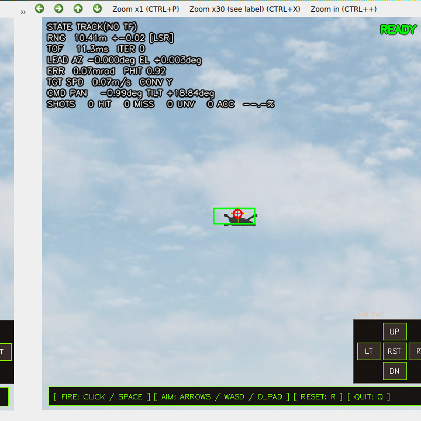
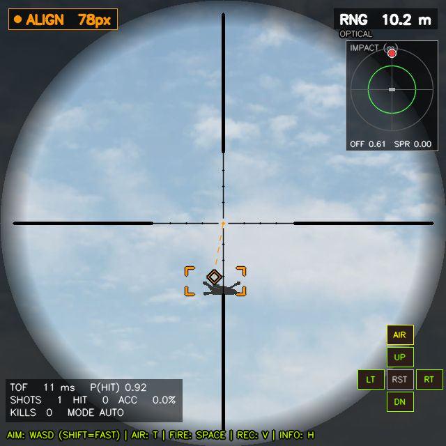
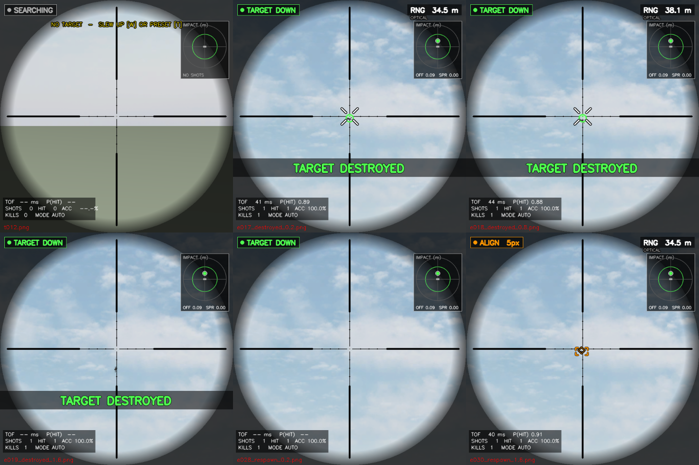
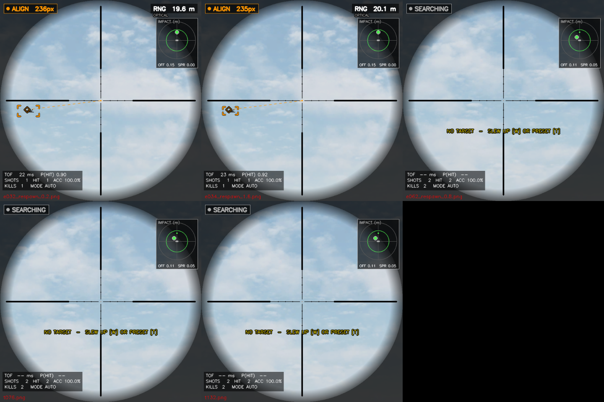
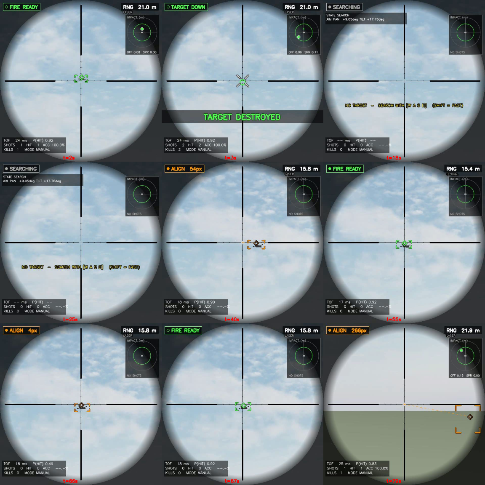
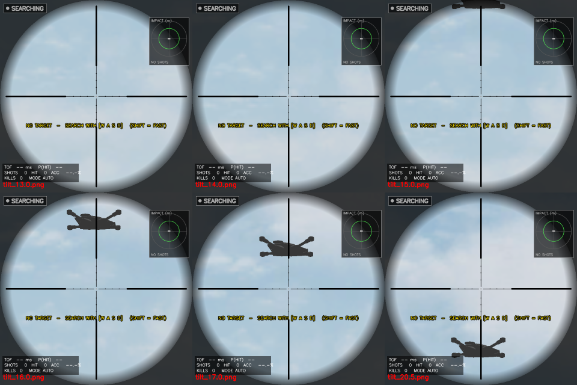

# SMASH 세션 작업 정리 — 시뮬레이터 처리율 개선과 시연 화면 개편 (2026년 9월 18일)

2026-09-12 세션(`session_work_summary_2026-09-12.md`)에서 이어진 작업이다. 두 갈래로 진행했다.

1. **성능**: 남은 후보였던 "카메라 해상도 640 → 320"을 검증하다가, 해상도와 무관한 병목 두 개를
   찾아 고쳤다. 640 해상도를 유지한 채 FCS 처리율이 약 2.4배가 됐다.
2. **시연**: 호버링 단계 시연을 보기 좋게 만들기 위해 HUD 를 새로 짜고, 탄착 과녁 패널, 격추 연출,
   녹화 기능을 넣었다.

모든 수치는 WSL2 Ubuntu 24.04 / ROS 2 Jazzy / i5-7400(4코어, HT 없음) / GTX 1050 Ti 에서 직접
실행해 측정했다. **아직 커밋하지 않았다.**

---

## 1. 요약

| 항목 | 이전 | 이후 |
|---|---|---|
| FCS 처리율 (640, 10.8 m) | 7.4 ~ 9.7 Hz | **23.5 ~ 24.6 Hz** |
| FCS 처리율 (640, 35.3 m) | 7.8 ~ 11.5 Hz | **17.2 ~ 21.2 Hz** |
| 35 m READY 비율 | 73 ~ 83 % | **94 %** |
| 명중률 (정지 호버링, 10.8 m / 35.3 m) | 100 % | 100 % (유지) |
| HUD 그리기 비용 | 9.7 ~ 12.1 ms/프레임 | **4.5 ms/프레임** |
| 카메라 320 전역 전환 | 결정 보류 | **기각** (35 m 에서 격발 불가) |

---

## 2. 성능 작업

### 2.1 카메라 320 해상도 — 기각

이전 세션 5절의 "320 이면 FCS 처리율 약 3배"를 자동 조준 절차로 다시 검증했다. 조건마다 자동 조준으로
오차를 최소화한 뒤 60초 동안 측정했고, 2회 반복했다.

| | 640 / 10.8 m | 320 / 10.8 m | 640 / 35.3 m | 320 / 35.3 m |
|---|---|---|---|---|
| FCS 처리율 | 6.5 ~ 6.8 Hz* | 16.9 ~ 17.0 Hz | 6.4 Hz* | 14.8 ~ 15.5 Hz |
| READY 비율 | 97 ~ 99 % | 92 % | 62 ~ 69 % | **0 %** |
| 명중 / 판정 | 523 / 530 | 754 / 763 | 367 / 368 | **격발 0 발** |

\* 측정 스크립트가 640 영상을 한 번 더 구독한 탓에 640 수치가 깎였다. 추가 구독이 없던 실행에서는 약 10 Hz.

- 320 은 10.8 m 에서는 문제가 없지만 **35 m 에서는 격발이 한 발도 나가지 않는다.** 표적이 가로 약 10 px 로
  줄어 추적 신뢰도 중앙값이 0.60 으로 임계값(0.6)에 걸리고, 조준 엔진이 SEARCH 에 머문다. 조준 오차를
  1 px 까지 맞춰도 READY 가 켜지지 않았다.
- 35 m 정지 호버링은 로드맵 1단계 기준 조건이므로 전역 전환은 기각한다. 임계값을 낮추는 것은 판정 기준을
  느슨하게 만드는 사양 변경이라 하지 않았다.
- 이전 세션의 "20.6 Hz"는 격발 제어를 끈 옛 코드 기준이라 이번 결과와 직접 비교되지 않는다.

### 2.2 수정 ① — TF 조회 헛대기 제거

FCS 노드의 단계별 시간을 계측해 보니, 영상 한 장 처리(128 ~ 140 ms) 중 **카메라 자세(TF) 조회가 54 ~ 70 ms**
를 차지했다.

**원인.** `tf_timeout_s = 0.05` 로 원하는 시각의 변환을 최대 50 ms 기다리게 되어 있었다. 그런데 rclpy 의
tf2 `Buffer` 는 기다리는 동안 `sleep(0.02)` 로 폴링하며 호출 스레드를 막는다. 이 노드는 단일 스레드
실행기라 그동안 `/tf` 수신 콜백이 돌지 못하고, 따라서 **기다려도 변환이 절대 들어오지 않는다.** 매번
50 ms 를 다 쓰고 실패한 뒤 "최신 변환" 재시도로 넘어가고 있었다. 같은 스레드의 명령 발행·격발 판정
타이머도 함께 굶었다.

**수정.** `tf_timeout_s` 를 0 으로 바꿨다(대기 없음). 결과(최신 변환 사용)는 이전과 같다.

| 항목 | 수정 전 | 수정 후 |
|---|---|---|
| TF 조회 | 54 ~ 70 ms | 0.3 ms |
| 영상 한 장 처리 | 128 ~ 140 ms | 32 ms |
| 포탑 명령 발행 (목표 30/s) | 6.4 /s | 14.6 /s |
| 격발 판정 타이머 (목표 60/s) | 7 /s | 27 /s |

이 수정만으로는 FCS 처리율이 약 10 Hz 에서 오르지 않았다. 노드 사용률이 30 % 수준으로 떨어졌는데도
영상이 그만큼만 들어왔기 때문이다. 이것이 아래 ②로 이어졌다.

### 2.3 수정 ② — 640 영상이 절반씩 유실되던 문제 (핵심)

**원인.** Fast DDS 의 기본 공유메모리(SHM) 세그먼트는 512 KB 다. 640×640 RGB 영상 한 장(1.23 MB)은
들어가지 못해 UDP 조각 전송으로 넘어가고, best-effort 구독에서 절반가량이 유실됐다. 320×320(307 KB)은
세그먼트에 들어가므로 유실이 없었다. 320 이 빨랐던 진짜 이유도 대부분 이것이다.

포탑 장면만 띄우고(FCS 없이) 영상 도착률과 카메라 실제 주기를 비교했다.

| 조건 | 영상 도착 / 카메라 실제 주기 |
|---|---|
| 640, 기본 설정 | 10.9 / 23.6 Hz, 13.8 / 24.6 Hz |
| 640, 공유메모리 16 MB 프로파일 | **23.2 / 23.2 Hz, 24.9 / 25.0 Hz** |
| 640, `ros_gz_image` 영상 전용 브리지 | 11.2 / 26.6 Hz, 9.2 / 22.8 Hz (효과 없음) |
| 320, 기본 설정 | 23.7 / 23.7 Hz, 18.3 / 18.3 Hz |

**수정.** 공유메모리 세그먼트를 16 MB 로 늘린 Fast DDS 프로파일
(`ciws_turret/config/fastdds_large_messages.xml`)을 추가했다. `view.launch.py` 가 이 프로파일을
자동 지정한다(사용자가 이미 지정한 프로파일이 있으면 그것을 따른다). 다른 호스트와의 통신을 위해
UDPv4 도 함께 켜 두었다.

전체 장면(FCS 포함, 640, 격발 제어 자동, 2회 반복) 결과:

| | 기본 설정 | 프로파일 적용 |
|---|---|---|
| FCS 처리율 10.8 m | 9.7 / 7.4 Hz | **23.5 / 24.6 Hz** |
| FCS 처리율 35.3 m | 7.8 / 11.5 Hz | **17.2 / 21.2 Hz** |
| 35 m READY 비율 | 73 / 83 % | **94 / 94 %** |
| 명중 / 판정 (60초) | 전부 100 % (242 ~ 376 발) | 전부 100 % (481 ~ 562 발) |

런치 기본값만으로 재확인한 결과, 영상이 카메라 주기 그대로 도착했고 FCS 는 17.0 / 21.7 Hz 가 나왔다
(측정용 영상 구독이 켜진 상태라 실제보다 약간 낮다).

**부수 조치.** 노드를 `kill -9` 로 끝내면 참가자마다 16 MB 공유메모리 파일이 `/dev/shm` 에 남는다.
런처(`wsl_setup_smash_fcs.sh`)가 실행 전에 `fastdds shm clean` 으로 쓰지 않는 파일만 정리한다.

---

## 3. 시연 화면 개편

### 3.1 채택 범위 (사용자 결정)

| 항목 | 결정 |
|---|---|
| HUD 재디자인 | 구현 |
| 탄착 과녁 패널 | 구현 |
| 격추 연출 (낙하 후 재출현) | 구현 |
| 녹화 (MP4) | 구현 |
| FCS ON/OFF 비교 | **이동 표적 단계로 연기** (3.6절) |
| 이동 표적 시나리오 | 호버링 완성도를 올린 뒤 추가 |
| 3인칭 관전 카메라 | 제외. 과거 시도 때 부하로 PC 가 멈췄다 |
| 킬캠 리플레이 | 제외 (부하 우려) |
| 배경·지형 | 추후로 연기 |

### 3.2 HUD 재디자인

| 이전 | 이후 |
|---|---|
|  |  |

- 원형 스코프 비네팅과 실제 소총 조준경 모양의 듀플렉스 십자선
- 표적 모서리 괄호. 포착 직후 크게 벌어졌다가 0.35초 동안 조여 드는 잠금 연출
- 좌상단 상태 표시줄: SEARCHING(회색) → TRACKING(노랑) → ALIGN(주황, 남은 오차 px) →
  FIRE READY(초록, 깜빡임)
- 조준점(리드 레티클)은 마름모로 표시하고, 정렬 전에는 십자선에서 조준점까지 점선 유도선을 그린다
- 명중 시 화면 중앙 히트마커, 격추 시 "TARGET DESTROYED" 배너
- 하단 요약 3줄: 비행시간·명중확률 / 발수·명중·명중률 / 격추 수·격발 모드
- 기존 디버그 수치 8줄은 기본으로 숨기고 H 키로 켠다

그리기는 새 모듈 `drone_sim/smash_fcs/hud.py` 로 분리했다. 실측 비용은 프레임당 **4.5 ms**
(이전 HUD 9.7 ~ 12.1 ms). 비네팅 마스크는 해상도별로 한 번만 만들고, 반투명 패널은 해당 영역만
어둡게 하기 때문이다.

### 3.3 탄착 과녁 패널

화면 우상단에 표적 중심 기준 탄착 분포를 그린다.

- 좌표: 표적 중심 기준, 시선에 수직인 평면(좌우·상하, 미터). 판정 시 탄도의 최근접점과 실측 표적
  위치의 차이다.
- 초록 원 = 명중 반경(0.1975 m). 명중은 초록 점, 빗나감은 빨간 점. 가장 최근 탄은 크게 표시한다.
- 하단에 평균 편차(OFF)와 산포(SPR)를 표시한다.
- C 키로 초기화한다.

진단 도구로도 쓸모가 있었다. 5절의 0.61 m 이상치가 패널에 바로 드러났다.

### 3.4 격추 연출

새 노드 `drone_sim/demo_director.py`.

- 명중하면 표적이 뒤집히며 자유낙하하고, 지면에 잠시 머문 뒤(모의 시각 2초) 새 표적이 나타난다.
- 표적은 kinematic 모델이라 물리로 떨어지지 않는다. Gazebo `set_pose` 서비스(ros_gz_bridge 로 연결)로
  낙하를 직접 그린다.
- FCS 노드는 `/smash_fcs/target_event` 로 격추·재출현을 통보받는다. 낙하 중에는 격발을 멈추고, 재출현하면
  추적을 초기화해 새로 포착한다.
- 재출현 위치는 20 m 좌측 → 15 m 우측 → 35 m 정면 → 10.8 m 정면 순서로 돈다(world +y 가 왼쪽). 같은 자리에 다시 띄우면
  포탑이 이미 그곳을 겨누고 있어 재조준 없이 곧바로 격추되므로(실측 확인) 시연이 단조로웠다.

- 런치 인자: `demo_kill`(기본 true, 격발 제어가 켜져 있을 때만 동작), `respawn_positions`
  (`[x,y,z, ...]`, `[0.0]` 이면 처음 자리).

### 3.5 녹화와 뷰어 조작

- Windows 뷰어(`scripts/win_scope_viewer.py`)에서 **V** 로 녹화를 시작·종료한다. 저장 위치는
  `recordings/`(git 제외)다.
- 조작 버튼과 안내문 없이 HUD 화면만 저장한다. 영상 도착 간격이 고르지 않아 벽시계 기준 20 fps 로
  채워 넣으므로 재생 속도가 실제와 같다(2.1초 입력 → 43프레임 확인).
- **H**: HUD 상세 수치 토글, **C**: 사격 통계 초기화. WSL 뷰어의 `/cmd` HTTP 경로가 FCS 로 중계한다.
- WSL 뷰어가 스트림에 조작 버튼·안내문을 한 벌 더 그려 Windows 뷰어 버튼과 겹치던 것을 없앴다
  (WSL 창은 원래 비활성이다).

### 3.6 FCS ON/OFF 비교를 연기한 이유

호버링 표적에서는 차이가 나지 않는다.

- 총열은 조준축 66 mm 아래에 평행하게 있다.
- 35 m 에서 탄 낙차는 1 cm 미만이다(비행시간 40 ms).
- 따라서 FCS 없이 표적 중심에 십자선을 대도 약 0.07 m 빗나가는데, 명중 반경(0.1975 m) 안이라 명중이다.

리드(이동 표적)가 필요하거나 150 m 이상 떨어져야 차이가 나는데, 150 m 에서 표적은 3 ~ 4 px 라 탐지가
안 된다. 이동 표적 단계에서 넣는다.

---

## 4. 검증

| 항목 | 방법 | 결과 |
|---|---|---|
| HUD 표시 | 실제 장면에서 격추·재출현 전후 프레임 캡처 | 정상 (위 그림) |
| HUD 비용 | FCS 단계별 계측 | 4.5 ms/프레임, FCS 20.6 Hz |
| 격추 연출 | 35 m, 10.8 m 실행 | 격추 → 낙하 → 재출현 → 재포착 반복 확인 |
| 재출현 순환 | 10.8 m 시작 | (20, 3, 7.4) → (15, -2.5, 5.6) 순서 확인 |
| 뷰어 명령 중계 | Windows 에서 HTTP `/cmd`, `/slew` 호출 | FCS 로그에서 수신 확인 |
| 녹화 | `Recorder` 클래스를 Windows Python 으로 실행 | 20 fps MP4 정상 |
| Windows 뷰어 창의 키 입력 전체 | 실제 창에서 직접 조작 (9절) | 정상. 이 과정에서 결함 7건(기능 6, 표시 1)을 찾아 고쳤다 |

---

## 5. 발견했지만 조치하지 않은 것

1. **전체 장면이 실시간보다 느리게 돈다 (RTF 약 0.45 ~ 0.8).** 격추 → 재출현이 모의 시각 4.6초인데
   실제로 9.5 ~ 11.0초 걸렸다. 낙하가 약간 느리게 보이는 원인이다. 물리 스텝이 1 ms(1 kHz)라 이것을
   늘리면 빨라질 가능성이 있다. 다만 포탑 관절 제어 안정성(이전의 포탑 미동작 문제와 같은 계층)에 영향을
   줄 수 있어 이번에는 건드리지 않았다.
2. **약 0.61 m 위로 빗나가는 이상치가 반복된다.** 해상도·거리와 무관하게 miss_distance 0.611 ~ 0.614 m 가
   나왔다. 이번에는 프리셋으로 포탑을 크게 돌린 직후 첫 발에서 재현됐다. 슬루 중 격발과 관련 있어 보이나
   원인은 확인하지 않았다.

---

## 6. 측정상 주의 (다음 측정 때 참고)

- `top -b -n1` 의 첫 샘플은 프로세스 시작 이후 평균이라 모델 로딩 비용이 섞인다. 두 번째 샘플을 볼 것.
  이번 세션 초반에 "FCS 프로세스 CPU 140 ~ 200 %"로 잘못 보고했다가 정정했다(실제 30 ~ 40 %).
- 측정용으로 640 영상을 추가 구독하면 그 자체가 전송 부하가 되어 결과를 깎는다.
- best-effort 구독의 `camera_info` 수신 횟수는 유실 때문에 실제 카메라 주기보다 낮게 나올 수 있다.
- `gz topic -e` 로 RTF 를 매초 샘플링하면 Ruby 프로세스 기동 부하가 커서 측정을 왜곡한다.
- 자동 조준·단계별 계측 도구는 세션 임시 폴더에만 있다. 반복 측정이 필요하면 `benchmarks/` 로 옮길 것.

---

## 7. 변경 파일 (미커밋)

| 파일 | 내용 |
|---|---|
| `ciws_turret/config/fastdds_large_messages.xml` (신규) | Fast DDS 공유메모리 16 MB 프로파일 |
| `ciws_turret/launch/view.launch.py` | DDS 프로파일 자동 지정, `camera_px` 인자 |
| `ciws_turret/urdf/ciws_turret.urdf.xacro` | 카메라 해상도 xacro 인자(기본 640) |
| `drone_sim/config/smash_fcs.yaml` | `tf_timeout_s` 0.05 → 0.0 |
| `drone_sim/drone_sim/smash_fcs_node.py` | TF 대기 기본값, 새 HUD 연동, 격추 이벤트·뷰어 명령 수신, 탄착 좌표 계산 |
| `drone_sim/drone_sim/smash_fcs/hud.py` (신규) | 시연용 HUD 렌더러 |
| `drone_sim/drone_sim/demo_director.py` (신규) | 격추 연출·재출현 노드 |
| `drone_sim/launch/smash_scene.launch.py` | `camera_px`, `demo_kill`, `respawn_positions` 인자, 연출 노드·set_pose 브리지 |
| `drone_sim/drone_sim/smash_scope_viewer.py` | `/cmd` 중계, 스트림에 버튼 중복 그리기 제거 |
| `drone_sim/setup.py` | `demo_director` 실행 파일 등록 |
| `scripts/win_scope_viewer.py` | 녹화(V), HUD 상세(H), 통계 초기화(C) |
| `scripts/wsl_setup_smash_fcs.sh` | 실행 전 `fastdds shm clean` |
| `.gitignore` | `/recordings/` |

(경로는 `simulation/ciws_turret_aerial_object_detection-main/` 기준, `scripts/`·`.gitignore` 는 저장소 루트)

WSL 워크스페이스는 symlink-install 이 아니므로, 위 변경은 `colcon build --packages-select ciws_turret drone_sim`
이후에 반영된다. 이번 세션에서 빌드까지 마쳤다.

---

## 8. 다음 단계 후보

1. ~~Windows 뷰어에서 V/H/C 키를 직접 확인~~ — 9절에서 완료
2. 변경 사항 커밋
3. 0.61 m 이상치 원인 규명 (슬루 중 격발 여부)
4. 물리 스텝 조정으로 RTF 개선 (포탑 제어 안정성 재검증 동반)
5. 이동 표적 시나리오와 FCS ON/OFF 비교 (로드맵 4단계)

---

## 9. 실행 테스트 (2026-09-18 저녁)

사용자 요청으로 직접 실행해 시험했다. 자동 시험과, 런처와 같은 경로로 띄운 실제 화면에서의 조작 시험으로
나눴다.

### 9.1 자동 시험

| 시험 | 결과 |
|---|---|
| 기존 pytest (조준 코어) | 146 / 146 통과 |
| 신규 `tests/test_smash_hud.py` (탄착 좌표 변환 4건, HUD 렌더 7건) | 11 / 11 통과 |
| 런처 7번: 격발 판정 오라클 검증 (`verify_stage3_fire_control.py`) | 11 / 11 항목 통과 |

### 9.2 실제 조작 시험

**조건.** 런처 5번과 같은 명령(`wsl_setup_smash_fcs.sh run`, 격발 제어 수동, 스코프 뷰어 포함)으로
시뮬레이터를 띄우고, Windows 뷰어(`win_scope_viewer.py`) 창을 실제 키 입력으로 조작했다.
표적은 기본 배치(10.8 m) 에서 시작해 격추될 때마다 재출현 위치를 돈다.

| 항목 | 조작 | 결과 |
|---|---|---|
| 영상 수신 | 뷰어 기동 | 연결·표시 정상 |
| 정밀 조준 | W/A/S/D | 1회 입력당 1회 선회, 방향 정상 (수정 후) |
| 고속 선회 | Shift + A/D | 4도 단위 선회, 시야 밖 표적 재포착 정상 |
| 대공 프리셋 / 수평 리셋 | T / R | 정상 |
| READY 전 격발 | Space | 거부 + "NOT READY - HOLD FIRE" 표시 (신규) |
| READY 격발 | Space | 1회 당김 = 1발. 3회 격발 3회 명중 (10.8 m, 20 m, 15 m) |
| READY 상태 방치 | 6초 대기 | 저절로 격발되지 않음 (수정 후) |
| 격추 연출 | 명중 | 격추 배너 → 낙하 → 재출현 → 재포착, 3회 반복 정상 |
| HUD 상세 | H | 켬/끔 정상 |
| 통계 초기화 | C | 발수·격추 수·탄착 패널 초기화 정상 |
| 녹화 | V | 4개 파일 생성, 모두 640x640, 실제 시간과 재생 길이 일치 (예: 95초 기록 → 94.8초, 1,897프레임) |
| 종료 | ESC / 창 닫기 | 정상 (수정 후). 녹화 중 종료하면 파일이 정상 마감된다 |
| 다른 창 입력 격리 | 뷰어를 띄운 채 메모장에 W/A/S/D/T/V/H/C/Space 입력 | 뷰어 반응 없음 (수정 후) |

위 그림은 마지막 녹화(83초)에서 뽑은 프레임이다. READY → 격추(2격추째) → 통계 초기화 → 탐색 → 15 m
표적 포착·정렬 → READY 순서다. 마지막 칸은 R(수평 리셋) 직후로, 지면 쪽을 보고 있다.

### 9.3 시험 중 발견해 고친 결함

| # | 결함 | 영향 | 수정 |
|---|---|---|---|
| 1 | **수동 격발이 첫 발 이후 먹지 않음.** 뷰어는 당길 때 True 만 보내고 놓는 신호가 없는데, FCS 가 그 값을 눌림 상태로 계속 들고 있었다. 수동 모드는 상승 엣지에서만 쏘므로 두 번째 당김부터 무시됐다 | 09-13 사용자 보고("방아쇠를 당겨도 SHOTS 가 안 오름")의 한 원인 | 방아쇠를 "한 번 당김" 사건으로 처리하고 격발 틱에서 한 번 소비한다 (`smash_fcs_node.py`) |
| 2 | **아무도 당기지 않았는데 한 발이 나감.** 1번 때문에 눌림 상태가 남은 채 표적을 다시 물면(SEARCH 재진입으로 엣지 상태 초기화) 다음 READY 에서 저절로 격발됐다 | 수동 모드인데 자동 사격처럼 동작 | 1번 수정으로 함께 해소. READY 에서 6초 방치해도 격발 없음 확인 |
| 3 | **좌우 조준이 반대.** 왼쪽 키가 pan 을 음수(오른쪽)로 보냈다. ROS 관례상 왼쪽이 + 다 | 화면 왼쪽 표적을 향해 A 를 누르면 표적이 화면 밖으로 밀려남 | 두 뷰어의 키·버튼·웹 페이지 5곳에서 부호 교정 |
| 4 | **다른 창에서 친 키가 조준·격발로 들어감.** `GetAsyncKeyState` 는 포커스와 무관하게 키 상태를 돌려준다 | 뷰어를 띄워 둔 채 다른 창에서 타이핑하면 포탑이 돌고 격발 명령이 나감. 시험 중 이전 뷰어 인스턴스가 메모장 입력을 받아 선회·녹화·격발한 것을 실제로 확인 | 뷰어 창이 맨 앞일 때만 키를 받는다 (`win_scope_viewer.py`) |
| 5 | **정밀 조준 스텝이 READY 허용오차보다 큼.** 0.010 rad(약 16 px)는 허용오차가 35 px 고정이던 때 값이다. 허용오차가 거리 기반으로 바뀐 뒤로는 20 m 에서 약 16 px, 35 m 에서 약 9 px 라 한 번 누를 때마다 허용오차를 건너뛰었다 | 20 m 이상에서 키로 READY 에 들어가기 어려움 | 0.004 rad(약 6 px)로 축소. 20 m 표적을 3회 입력으로 READY 에 넣음 |
| 6 | **ESC/Q 로 종료가 안 됨.** 안내문은 "Q 또는 ESC"인데 코드는 ESC 만, 그것도 OpenCV `waitKeyEx` 로만 받았다 | 창이 닫히지 않음 | 다른 키와 같은 방식(포커스 조건부)으로도 받는다 |
| 7 | 녹화 표시(REC)가 탄착 패널 제목을 가림 | 표시 겹침 | 상단 가운데로 이동 |

### 9.4 남은 관찰 (미조치)

- **20 m 부근에서 READY 가 깜빡인다.** 레이저 거리측정이 끊겨 영상 기반 거리(±5 m)로 넘어가는 구간에서
  조준 엔진 상태가 READY 와 ALIGN 을 오간다. 이전 세션 13.2절의 "레이저 15 m 절벽"과 같은 뿌리로 보인다.
  이제는 READY 가 아닐 때 당기면 HUD 가 알려 주므로 사수가 혼란스럽지는 않다.
- **재출현 직후 한 프레임 정도 지면의 이전 위치를 물 수 있다.** 모의 시각이 실제보다 느려(5절 1번)
  재출현 위치 이동이 영상에 반영되기 전에 추적이 먼저 초기화되기 때문으로 보인다. 곧 새 위치를 다시 문다.
- 이 도구의 자동 키 입력은 수 ms 로 매우 짧아, 뷰어의 키 상태 폴링 사이에 끼면 놓칠 수 있다(사람이 누르는
  100 ms 안팎의 입력은 문제없음을 확인했다).

### 9.5 시험으로 추가·변경된 파일

| 파일 | 내용 |
|---|---|
| `tests/test_smash_hud.py` (신규) | HUD 단위 시험 11건 |
| `drone_sim/drone_sim/smash_fcs_node.py` | 방아쇠 1회 소비, READY 전 당김 표시 |
| `drone_sim/drone_sim/smash_fcs/hud.py` | "NOT READY - HOLD FIRE" 표시 |
| `drone_sim/drone_sim/smash_scope_viewer.py` | 좌우 부호 교정 |
| `scripts/win_scope_viewer.py` | 좌우 부호, 포커스 조건부 키 입력, 정밀 스텝 0.004 rad, ESC/Q 종료, REC 위치 |
| `drone_sim/launch/smash_scene.launch.py` | 재출현 위치 주석의 좌우 표기 정정 |

시험 녹화 파일 4개는 `recordings/`(git 제외)에 남겨 두었다.

---

## 10. 100 m 확장 1단계 측정 — 화각별 원거리 성능과 지연 시간 (2026-09-19 새벽)

"실제 조준경이라면 100 m 는 다뤄야 한다"는 문제 제기에 따른 측정이다. 코드 변경은 측정용 런치 인자
`camera_hfov`(기본 0.4 rad, 동작 변화 없음) 하나다.

**조건.** 정지 호버링 표적, 앙각 약 20도, 거리 10.8 / 35 / 60 / 100 m. 화각 23° / 11.5° / 6.9°
(0.4 / 0.2 / 0.12 rad), 640 px. 조건당 2회, 자동 조준 후 60초 격발(auto). 사용자 분석 스크립트가
끝난 뒤 측정했다. 무효 2회(Gazebo 기동 중 그래픽 오류 1회, 측정 도구 상태 수신 실패 1회)는 재측정했다.

### 10.1 화각별 결과

| 화각 | 10.8 m | 35 m | 60 m | 100 m |
|---|---|---|---|---|
| 23° (현재) | 70 px, READY 99 %, 440/440 | 21 px, 88 %, 423/423 | 18 px, **READY 0 %** | **탐지 불가** (약 7 px) |
| 11.5° | **탐지 불가** | 43 px, 97 %, 543/543 | 25 px, 86 ~ 89 %, 503/503 | 19 px, **READY 0 %** |
| 6.9° | **탐지 불가** | 70 px, 100 %, 549/549 | 40 px, 97 %, 543/543 | **25 px, 88 ~ 90 %, 492/496** |

(칸 안: 화면 속 드론 폭, READY 비율, 명중/판정)

- **정지 표적 100 m 는 화각 6.9° 에서 된다.** 명중률 99 %(496발 중 492발).
- READY 가 켜지려면 드론이 화면에서 **약 21 ~ 25 px 이상**이어야 한다. 18 ~ 19 px 에서는 탐지는
  되지만 추적 신뢰도가 기준(0.6)에 못 미쳐(0.31) 조준 엔진이 SEARCH 에 머문다.
- **좁은 화각은 가까운 표적을 못 잡는다.** 10.8 m 에서 드론이 화면 한가운데 크게 보이는데도 탐지가 0 이다.

### 10.2 가까운 표적을 못 잡는 원인 — 탐지기의 크기 상한

같은 드론 영상을 크기만 바꿔 탐지기에 직접 넣어 보았다(최고 신뢰도, 0.25 이상이면 탐지).

| 드론 폭 (카메라 영상 기준) | 입력 640 | 입력 960 (현재 탐색 설정) |
|---|---|---|
| 181 px | 0.00 | 0.00 |
| 135 px | 0.72 | **0.00** |
| 90 px | 0.72 | 0.76 |
| 63 px | 0.72 | 0.73 |
| 45 px | 0.56 | 0.71 |

탐지기는 모델 입력 기준 약 150 px 을 넘는 드론을 알아보지 못한다(학습 데이터가 작고 먼 드론 위주로
추정). 탐색 단계는 먼 표적을 위해 영상을 1.5배 키워(입력 960) 넣으므로, 카메라 기준 약 100 px 을 넘으면
놓친다. 6.9° 화각에서는 약 24 m, 11.5° 에서는 약 15 m 보다 가까우면 여기에 걸린다.

### 10.3 지연 시간

영상이 찍힌 시각(Gazebo 렌더 시각)부터 잰 실제 경과 시간이다. 모의 시각과 실제 시각의 대응을 별도
프로세스로 기록해 환산했다. 대표 조건(시뮬레이터 RTF 약 0.5):

| 구간 | 23° / 10.8 m | 6.9° / 35 m | 6.9° / 100 m |
|---|---|---|---|
| 촬영 → FCS 수신 (렌더·전송·대기) | 21 ms | 23 ms | 29 ms |
| FCS 처리 | 16 ms | 18 ms | 29 ms |
| **촬영 → 조준점 계산** 중앙값 / 상위 5 % | **38 / 95 ms** | **41 / 91 ms** | **70 / 149 ms** |
| 촬영 → 격발 결정 | 46 ms | 47 ms | 65 ms |
| 촬영 → HUD 영상 발행 (화면 표시 전) | 45 ms | 48 ms | 79 ms |

- 60 km/h(16.7 m/s) 표적은 격발 결정까지 **약 0.8 ~ 1.1 m**(상위 5 % 에서 1.6 ~ 2.3 m) 움직인다. 명중 반경
  0.2 m 의 4 ~ 11배이므로 **지연 보정은 필수**다.
- 다만 영상마다 촬영 시각이 붙어 있으므로, 격발 순간의 현재 시각과 비교하면 **실제 지연을 프레임마다
  정확히 보정할 수 있다.** 평균값으로 보정하는 것이 아니라서 지연의 흔들림 자체는 치명적이지 않다.
  남는 오차는 표적 속도 추정 오차와 기동이다.
- 100 m 에서 처리 시간이 늘어난다(29 ms). 작은 표적이라 탐지기 재호출이 잦아진 것으로 보인다(미확인).
- 이 PC 는 Gazebo 와 FCS 가 같은 4코어를 나눠 쓰므로, 실제 장비의 지연은 이보다 작을 가능성이 크다.
  화면 표시까지의 지연(뷰어 전송·그리기)은 재지 않았다.

### 10.4 기타 관찰

- 화각이 좁을수록 평균 빗나감이 약간 커졌다(23°: 0.07 ~ 0.12 m, 6.9°: 0.11 ~ 0.17 m). 모두 명중 반경
  안이라 명중률에는 영향이 없었다. 원인은 확인하지 않았다.
- 측정 중 Gazebo 가 기동 단계에서 그래픽 오류(GLXBadFBConfig)로 1회 죽었고, 앞선 시험 중 WSL 이 2회
  재시작됐다. 원인 미확인.

### 10.5 결론과 다음 단계

1. **화각 6.9° 는 35 ~ 100 m 정지 표적을 커버한다.** 남은 문제는 가까운 표적이다.
2. 가까운 표적 문제는 **배율을 바꾸지 않고 탐지 쪽에서 풀 수 있다.** 큰 입력(960)에서 못 찾으면 작은
   입력(640, 320)으로 한 번 더 찾는 방식이다. 광학 줌이 아니므로 배율 전환 지연이 없고, 시스템이 스스로
   판단한다(1번 질문 "누가, 언제 확대하나"에 대한 답). 추적 중 표적 주변을 잘라 확대하는 경로에도 같은
   크기 상한을 적용해야 한다. 근본적으로는 가까운 드론 영상으로 탐지기를 추가 학습하는 방법도 있다.
3. 그다음 2단계: 격발 시각 기준 지연 보정과, 시뮬레이터가 실제 발사 시각에 가상 탄을 쏘도록 교정.

---

## 11. 다중 스케일 탐지 — 좁은 화각에서 가까운 표적 문제 해결 (2026-09-19)

10.2절의 원인(탐지기의 표적 크기 상한)을 `bridge/optical_flow_tracker.py` 에서 해결했다.

### 11.1 변경

| 경로 | 이전 | 이후 |
|---|---|---|
| 첫 포착 (전체 화면) | 입력 960 고정 | 프레임마다 960 → 640 → 320 순환. 한 프레임에 한 번만 추론하므로 탐색 부하는 같고, 최대 3 프레임 안에 크기와 무관하게 포착 |
| 추적 중 재확인 (표적 주변 확대) | 확대 결과를 입력 640 으로 | 표적이 모델 입력 기준 100 px 을 넘지 않도록 입력 크기를 고른다. 큰 표적은 256 까지 줄어든다 |
| 재포착 (전체 화면으로 떨어진 경우) | 입력 960 | 직전 표적 크기로 입력 크기를 고른다 |

- 상한 100 px 은 10.2절 시험을 **드론이 온전히 보이는 영상으로 다시 해서** 정했다. 처음 시험에 쓴 영상은
  드론이 화면 아래에 반쯤 잘려 있어 크기 효과와 잘림 효과가 섞여 있었다. 다시 한 결과(카메라 영상 기준
  드론 폭 → 입력 640 / 960 신뢰도): 181 px 0.00 / 0.00, 135 px 0.34 / 0.00, 90 px 0.72 / 0.27,
  63 px 0.76 / 0.75, 45 px 0.74 / 0.76. 10.2절의 수치는 이것으로 대체한다.
- `multi_scale=False` 로 이전 동작으로 되돌릴 수 있다(생성자 인자).
- **작업 중 만든 결함 하나를 잡았다.** 처음에는 `reset()` 이 순환을 960 으로 되돌리게 했는데, FCS 는
  SEARCH 동안 매 프레임 `reset()` 을 부르므로 입력이 960 에 고정됐다. 실행 중 탐지기 호출을 입력 크기별로
  세어 보고 알았다. 순환이 `reset()` 을 넘어 이어지게 고치고 그 경우를 시험으로 막았다.
- 시험: `tests/test_optical_flow_multiscale.py` 13건 추가, 전체 170 / 170 통과.

### 11.2 검증 (정지 표적, 조건당 2회)

| 화각 / 거리 | 드론 폭 | READY | 명중 / 판정 |
|---|---|---|---|
| 6.9° / 10.8 m | 235 px | 100 % | 374 / 374 (이전: 탐지 불가) |
| 6.9° / 20 m | 129 px | 100 % | 382 / 382 |
| 6.9° / 35 m | 74 px | 100 % | 302 / 324 |
| 6.9° / 60 m | 44 px | 96 ~ 97 % | 306 / 306 |
| 6.9° / 100 m | 26 px | 86 % | 285 / 291 |
| 11.5° / 10.8 m | 147 px | 100 % | 156 / 156 (1회 유효, 이전: 탐지 불가) |
| 23° / 35 m (기존 성능 회귀 확인) | 21 px | 82 ~ 88 % | 329 / 329 (이전과 같음) |

**화각 6.9° 하나로 10.8 m 부터 100 m 까지 커버한다.** 합계 명중률 98.3 % (1,677 판정 중 1,649).

- 빗나감은 모두 명중 반경 바로 바깥(0.198 ~ 0.205 m)에 몰려 있다. 6.9° / 35 m 1회차는 자동 조준이
  READY 허용오차 가장자리(12 px)에서 멈춘 채 쐈고, 약 0.1 m 의 원인 미상 계통 편차가 더해져 경계를 넘었다.
  READY 허용오차가 명중 반경과 똑같아 여유가 없기 때문이다. 허용오차에 여유(예: 명중 반경의 70 %)를 두면
  줄어들 것이다(미조치).
- 11.5° / 10.8 m 2회차는 측정 스크립트가 FCS 상태를 받지 못해 무효다(10.1절과 같은 도구 문제).

### 11.3 이 측정의 한계

측정 직전(12:01)부터 Windows 에서 다른 작업(`pip install --target .report_deps reportlab`, 필자가 띄운 것
아님)이 코어 하나를 쓰고 있었다. 그 결과 시뮬레이터 RTF 가 0.28 ~ 0.35 로 10절 측정(약 0.5)보다 낮았다.
**탐지·READY·명중 결과는 유효하지만, FCS 처리율과 지연 수치는 10절과 비교할 수 없다.** 지연은 10.3절을
기준으로 본다.
