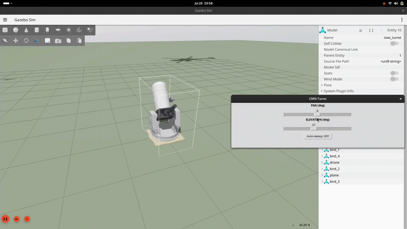
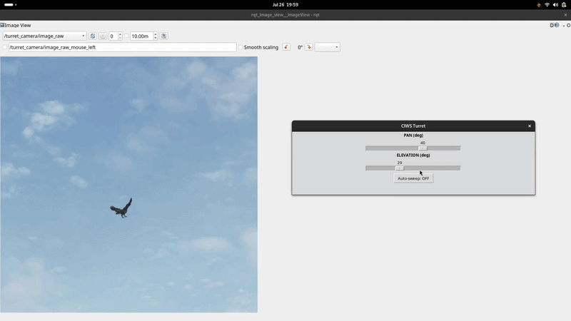
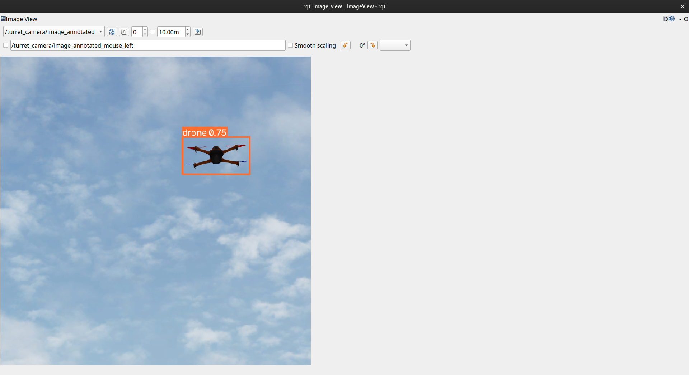
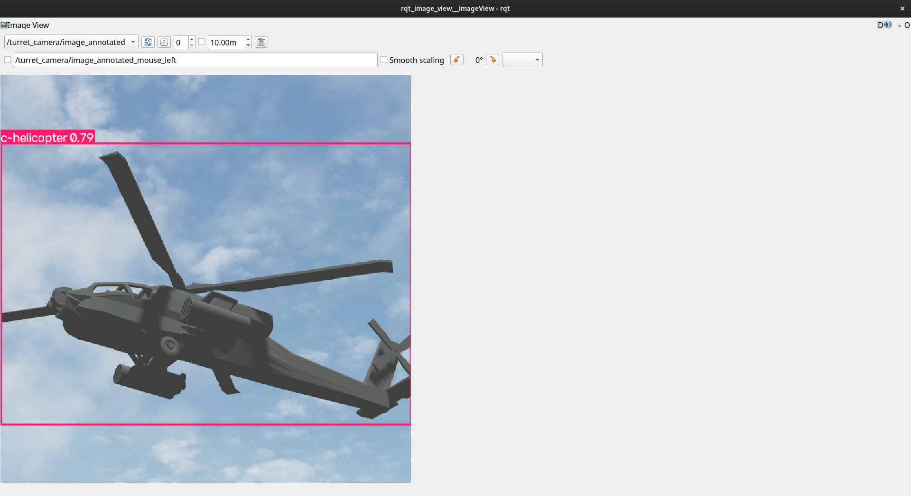
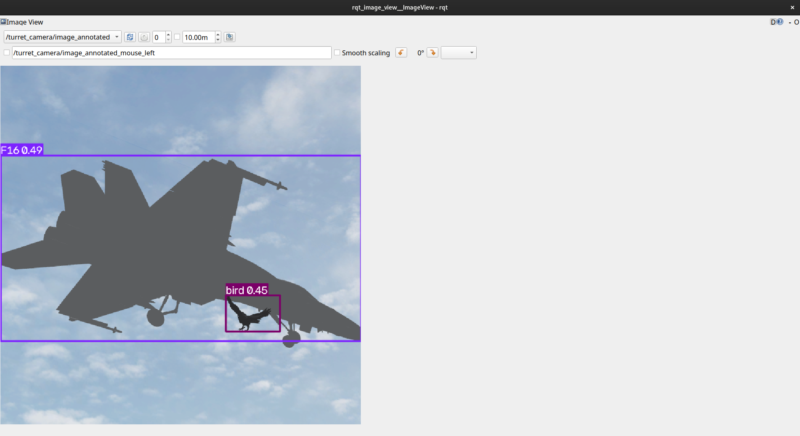

# ciws_turret_aerial_object_detection

A simulated **Centurion C-RAM / CIWS-style anti-air turret** built in **ROS 2 Jazzy**
and **Gazebo Harmonic**. A 360° pan + elevation turret with an onboard camera runs a
YOLO detector to spot and track aerial targets — a drone, an F-16, a helicopter, and
birds — flying through the sky.

## Demo

### Controlling the turret
<!-- Replace with your GIF: turret panning/elevating via the slider -->


### Detecting a bird and the F-16
<!-- Replace with your GIF: detection boxes on the bird and the jet -->


### Drone


### Helicopter


### F16


## Packages

| Package | Type | What it is |
|---|---|---|
| `ciws_turret` | ament_cmake | The robot: URDF/xacro, meshes, world, ros2_control (pan + elevation), camera, RViz, teleop slider |
| `drone_sim` | ament_python | The environment: flying targets (drone/plane/heli/birds), motion nodes, YOLO detector, tracker, camera zoom |

## Build

```bash
cd ~/ros2_ws && colcon build --packages-select ciws_turret drone_sim
source install/setup.bash
```

## Launch — everything in one command

```bash
ros2 launch drone_sim scene.launch.py
```

This starts the turret world, spawns the drone, F-16, helicopter, and 4 birds, and
runs the YOLO detector.

## Launch — turret only - (optional)

```bash
# 1) turret world 
ros2 launch ciws_turret view.launch.py
```

## Control & view

```bash
# pan + elevation sliders
ros2 run ciws_turret spin_slider.py

# camera feed with detection boxes (pick /turret_camera/image_annotated)
ros2 run rqt_image_view rqt_image_view

# live digital zoom
ros2 run drone_sim camera_zoom
```

Enable automatic tracking with `track:=true`.

## Topics

- `/turret_camera/image_raw` — raw camera
- `/turret_camera/image_annotated` — camera with detection boxes
- `/drone_detections` — `vision_msgs/Detection2DArray`
- `/turret_controller/commands` — `[pan, tilt]` in radians

# Disclaimer

The YOLO model used here was trained for **real-time aerial object detection on real
imagery**. Inside this Gazebo simulation, the targets are untextured, flat-shaded
renders that differ significantly from real-world footage, so the detector may show
**reduced accuracy or occasional misclassification** (for example, labeling the sim
drone as "airplane"). This is an expected **sim-to-real gap**, not a fault in the
pipeline — the same model performs reliably on real aerial footage. Accuracy in
simulation can be improved by texturing the models, adjusting lighting, or fine-tuning
the model on rendered frames.
